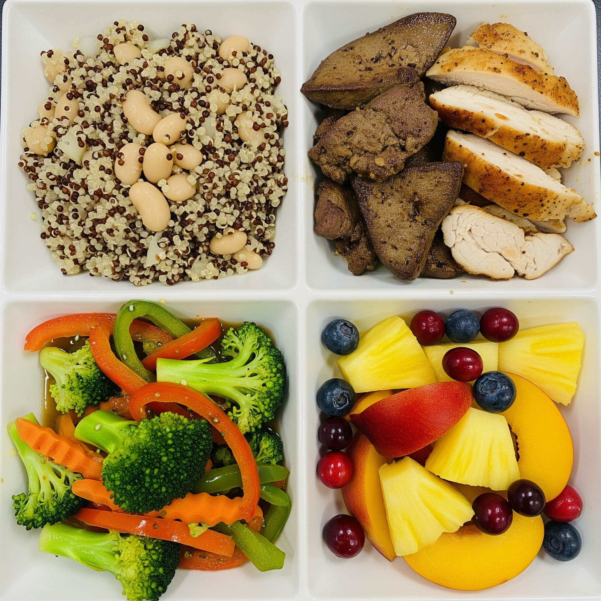

# **Pre-BizTrip Health Plan**

A structured approach to nutrition, activity, and rest.

---

## **Guiding Principles**

This plan is built on a foundation of routine, whole foods, and consistent activity.

* **Rhythm:** A consistent sleep and rest schedule.
* **Nourishment:** Nutrient-dense, whole-food meals.
* **Hydration:** Prioritizing water intake.
* **Movement:** Integrating varied physical activity into the week.
* **Mind:** Daily practices for mental engagement.

---

## **Sleep & Rest Schedule**

Rest is the foundation of recovery and energy.

* **Bedtime:** 9:00 PM
* **Wake Up:** 5:00 AM
* **Siesta:** 2:00 PM

This provides 8 hours of nightly sleep and a midday reset.

---

## **Daily Hydration**

Proper hydration is crucial for energy, digestion, and overall health.

* **Primary Goal:** 1 Gallon of water or soda water per day.
    * Enhance with fresh lemon juice.
* **Electrolytes:** 1 Nectar hydration pack per day.

---

## **Coffee Routine**

Strategic caffeine intake for focused energy.

* **Morning Coffee:** After waking up (post-5:00 AM)
* **Afternoon Coffee:** After your siesta (post-2:00 PM)

---

## **Meal Structure: The Plate Method**

Simplicity and consistency are key.

* **Frequency:** 3 meals per day.
* **Portion:** 1 plate per meal.

Focus on a balanced composition for each plate.

---

## **Core Components**

Each meal should be a mix of the following.

* **Base (~1/4 plate):**
    * Quinoa, Beans
* **Protein (~1/4 plate):**
    * Beef Liver, Salmon, Beef Steak, Pollo Asada
* **Vegetables (~1/3 plate):**
    * Mixed stir-fry: Carrots, Onions, Broccoli, Red Pepper, Zucchini, Garlic

---

## **Building Your Plate: Flavor & Nutrients**

Add these for healthy fats, micronutrients, and taste.

* **Healthy Fats:**
    * Goat Butter
* **Probiotics & Flavor:**
    * Indian Pickle (Achar)
* **Fruit (On the side or on the plate):**
    * Kiwi, Pineapple, Cranberries, Blueberries, Peaches, Grapes

---

---

## **Occasional Treat: Cereal Bowl**

For a different texture and taste, "here and there."

* **Base:**
    * Ezekiel Cereal
    * Oats + Sunflower Seeds + Raisins (Cold Cereal)
* **Fruit:**
    * Blueberries
* **Milk:**
    * Goat Milk

---

## **Weekly Exercise Plan**

A balanced routine for strength, cardio, and skill.

* **Mondays:** Pickleball.
* **Twice a Week:** Swimming, one-mile walk to the cafe.

---

## **Daily Mental Habits**

Keep the mind sharp and engaged.

* **Daily Reading:** Dedicate a specific block of time to read.
* **Daily Writing:** Journal, plan, or create.

---

## **A Day in the Life**

* **5:00 AM:** Wake up, Hydrate
* **5:15 AM:** Coffee #1
* **8:00 AM:** Meal #1
* **1:00 PM:** Meal #2
* **2:00 PM:** Siesta
* **3:00 PM:** Coffee #2
* **4:00 PM:** Activity (Swim/Pickleball)
* **5:00 PM:** Meal #3
* **6:00 PM:** Walk (1 mile)
* **9:00 PM:** Bedtime